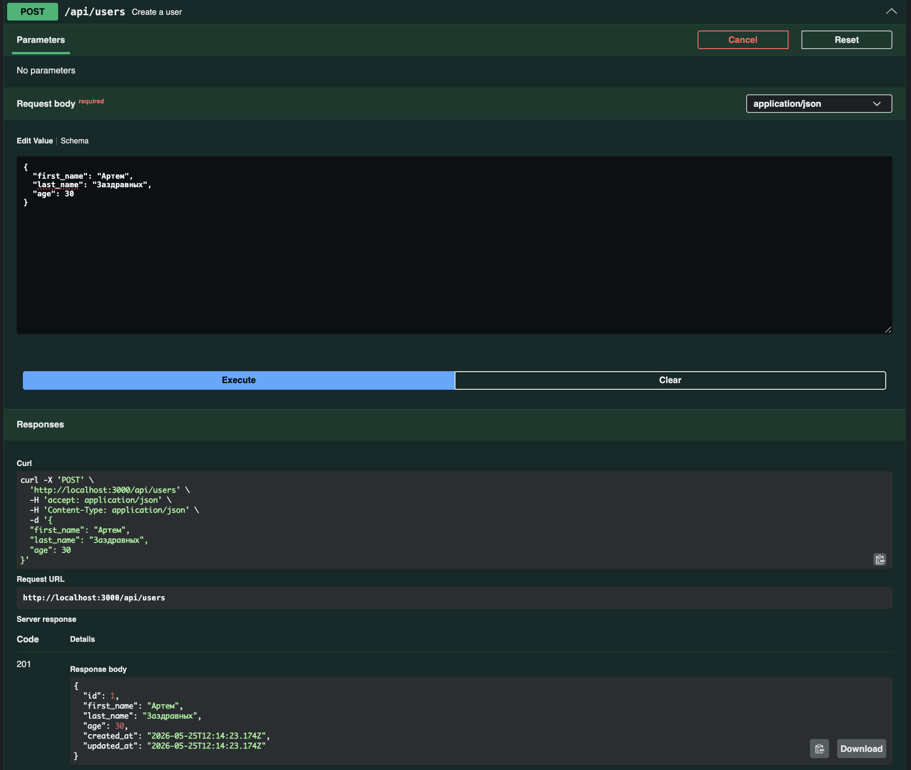
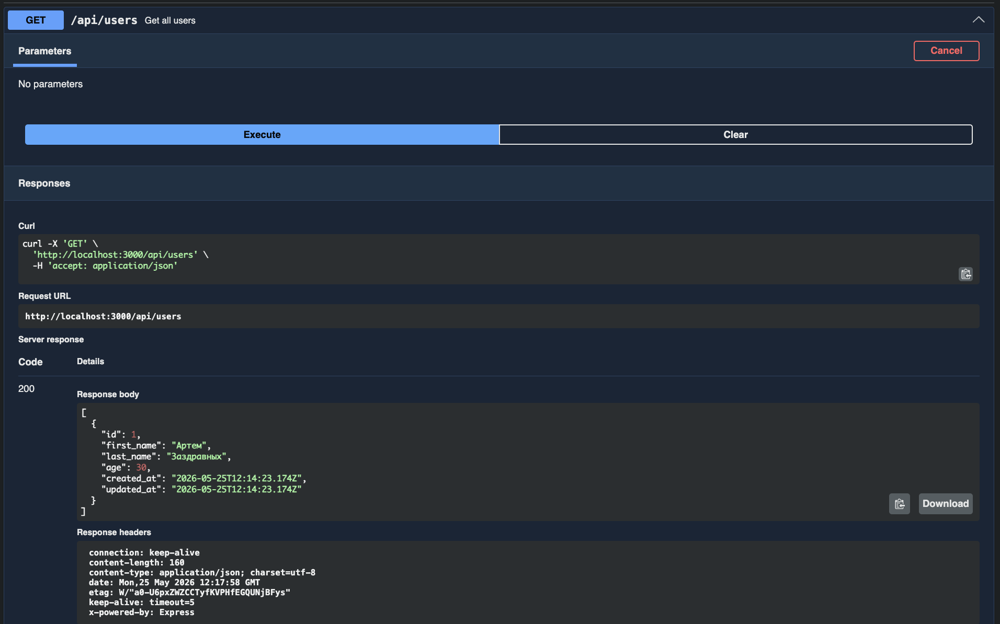
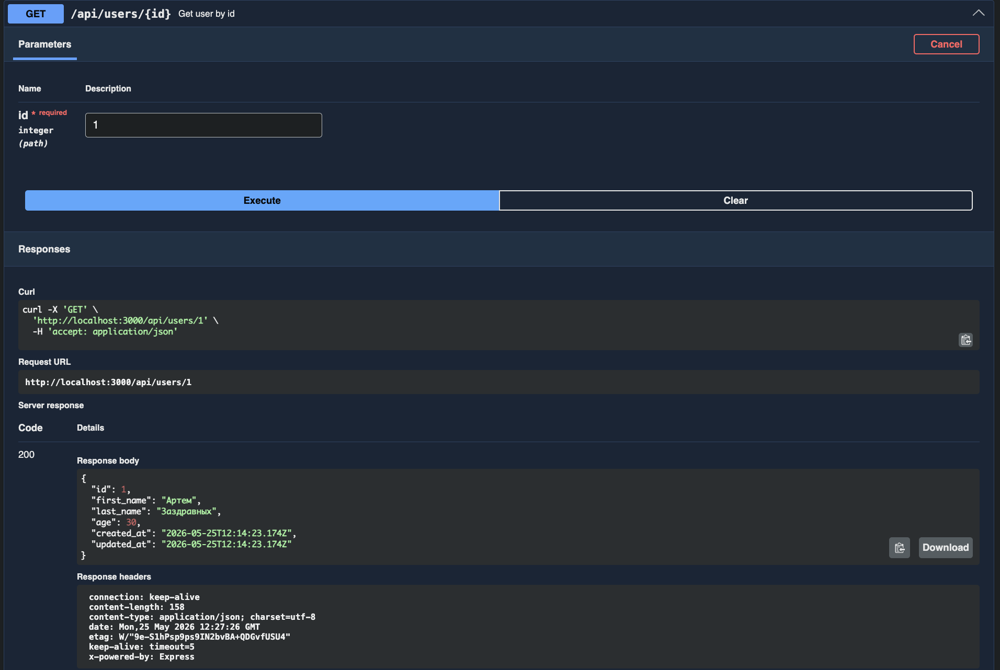
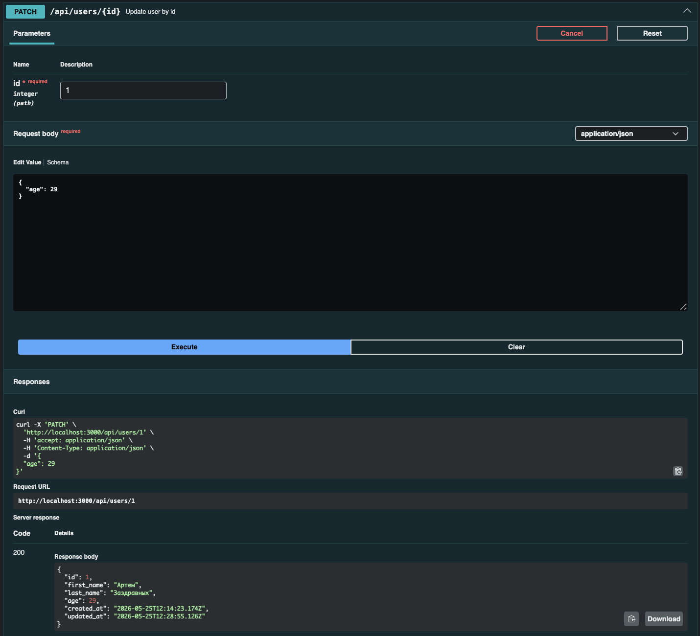
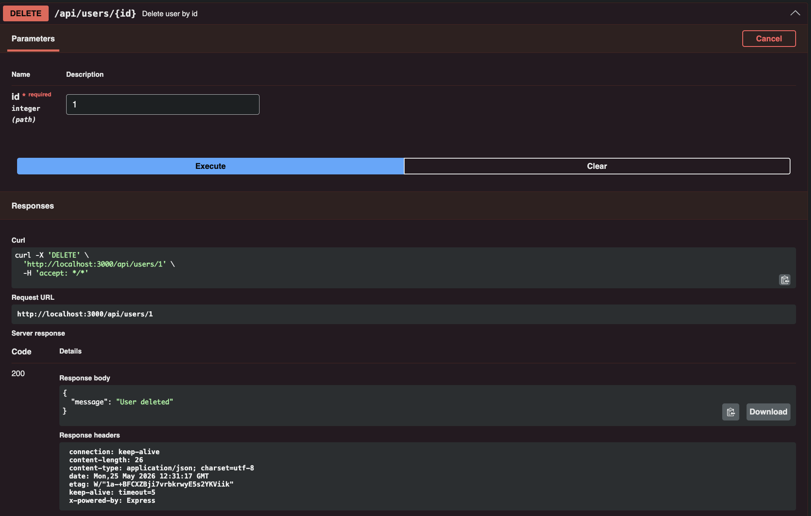

# Практическая работа №19
API для управления списком пользователей с использованием PostgreSQL и Swagger.
## Стек
- Node.js + Express
- PostgreSQL + Sequelize
- Swagger UI
## Установка и запуск
npm install
npm start
## API эндпоинты
| Метод | Адрес | Описание |
|---|---|---|
| POST | /api/users | Создать пользователя |
| GET | /api/users | Список пользователей |
| GET | /api/users/:id | Пользователь по ID |
| PATCH | /api/users/:id | Обновить пользователя |
| DELETE | /api/users/:id | Удалить пользователя |
## Скриншоты

### POST /api/users

### GET /api/users

### GET /api/users/:id

### PATCH /api/users/:id

### DELETE /api/users/:id

# Практическая работа №20

API для управления списком пользователей с использованием MongoDB и Swagger.

## Стек

- Node.js + Express
- MongoDB + Mongoose
- Swagger UI

## Установка и запуск

npm install
npm start

Сервер: http://localhost:3000
Swagger: http://localhost:3000/api-docs

## База данных

MongoDB, коллекция `users`:

| Поле | Тип | Описание |
|---|---|---|
| _id | ObjectId | Уникальный идентификатор |
| first_name | String | Имя |
| last_name | String | Фамилия |
| age | Number | Возраст |
| created_at | Date | Время создания |
| updated_at | Date | Время обновления |

## API эндпоинты

| Метод | Адрес | Описание |
|---|---|---|
| POST | /api/users | Создать пользователя |
| GET | /api/users | Список пользователей |
| GET | /api/users/:id | Пользователь по ID |
| PATCH | /api/users/:id | Обновить пользователя |
| DELETE | /api/users/:id | Удалить пользователя |

## Скриншоты

### POST /api/users

### GET /api/users

### GET /api/users/:id

### PATCH /api/users/:id

### DELETE /api/users/:id

# Практические работы №22-23

Балансировка нагрузки с Nginx, HAProxy и Docker Compose.

## Стек

- Node.js + Express
- Nginx (балансировщик)
- HAProxy (альтернативный балансировщик)
- Docker + Docker Compose

## Структура проекта

practices22-23/
├── docker-compose.yml
├── nginx.conf
├── backend/
│ ├── Dockerfile
│ ├── package.json
│ └── server.js
└── haproxy/
└── haproxy.cfg

## Установка и запуск

bash
docker compose up --build

## Backend серверы

Сервер	
Статус
backend1:3000	Основной
backend2:3000	Основной

## Проверка балансировки

curl http://localhost/
{"message":"Response from backend server","server":"backend-1","timestamp":"..."}

curl http://localhost/
{"message":"Response from backend server","server":"backend-2","timestamp":"..."}

curl http://localhost/
{"message":"Response from backend server","server":"backend-1","timestamp":"..."}

## Проверка отказоустойчивости

Остановить backend1

docker compose stop backend1

Запросы идут только на backend2

curl http://localhost/

{"server":"backend-2"}

curl http://localhost/

{"server":"backend-2"}

Вернуть backend1

docker compose start backend1

# Тестирование HAProxy
docker run -d --name haproxy \
  --network practices22-23_app-network \
  -p 8080:80 \
  -v $(pwd)/haproxy/haproxy.cfg:/usr/local/etc/haproxy/haproxy.cfg \
  haproxy:latest

curl http://localhost:8080/
